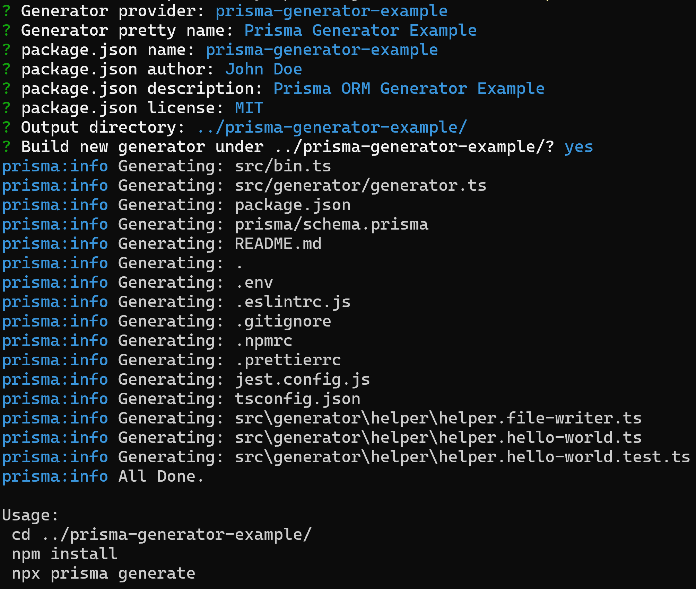
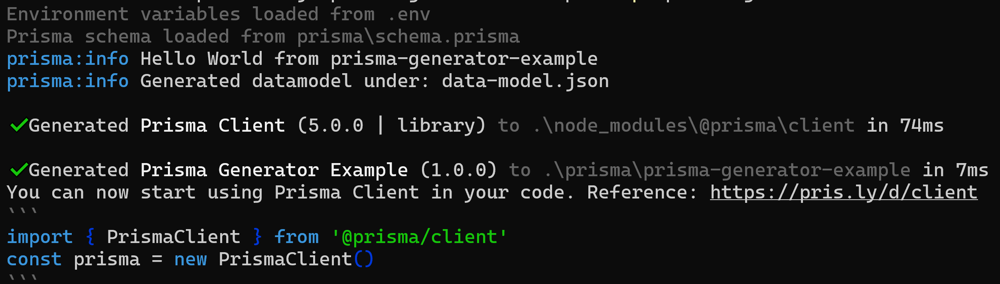

# prisma-generator-builder

Creates simple and ready to run `prisma generator`.

It has pluggable architecture, and new functionality can be easily provided with additional plugins.
Read more about [generator plugins here](README_PLUGINS.md).

Together with preconfigured packages, it creates project ready for development.

### Preconfigured packages

- typescript
- prisma
- eslint
- prettier
- jest

### Project structure

```
<project root>
└──src
    ├── bin.ts
    └── generator
         ├── helper
         ├    ├── helper.file-writer.test.ts
         ├    ├── helper.file-writer.ts
         ├    ├── helper.hello-world.test.ts
         ├    ├── helper.hello-world.ts         
         └── generator.ts            
    ├── package.json
    ...
    └── README.md
```

## Usage

Run the configurator to get started. 

```
npx prisma-generator-builder
```





## Custom Generator Development

### Helpers

#### HelloWorld Helper

The generator uses very basic `HelloWorld` helper example.
However, thanks  to this separation, prisma and custom generator
logic are not mixed together.

To see the example check [generator.ts](src/generator/generator.ts).


#### FileWriter Helper

Handles file writing.

`saveFile()` - saves any file
```typescript
FileWriter.saveFile("foo.txt", `foo`);
```


`saveTypescriptFile()` - saves and formats typescript file 

```typescript
FileWriter.saveTypescriptFile("foo.ts", `const foo="foo"; console.log(foo);`);
```

### Tests

Generated package comes together with pre-configured `jest`.

`npx jest`

```
 PASS  src/generator/component/helper.hello-world.test.ts
  Hello World
    √ hi() should use prisma logger to generate output (3 ms)

Test Suites: 1 passed, 1 total
Tests:       1 passed, 1 total
Snapshots:   0 total
Time:        2.521 s, estimated 3 s
Ran all test suites.
```

